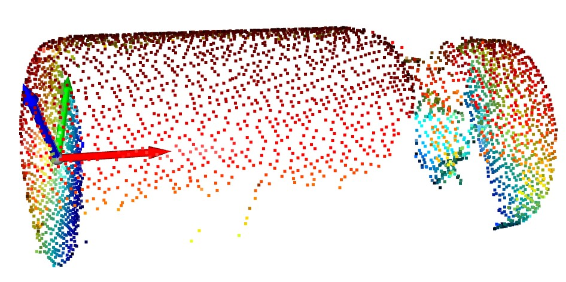
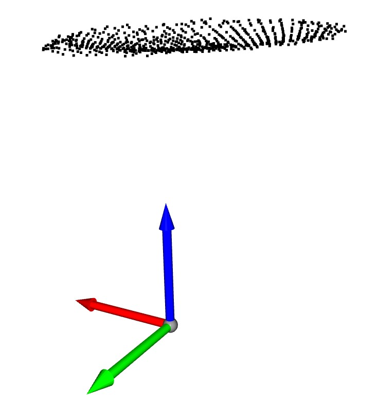
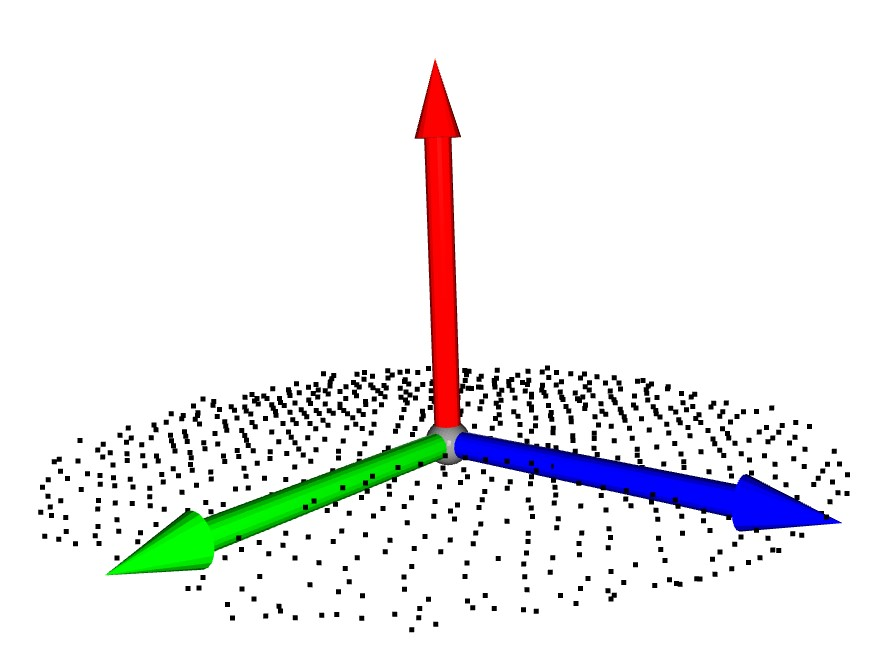
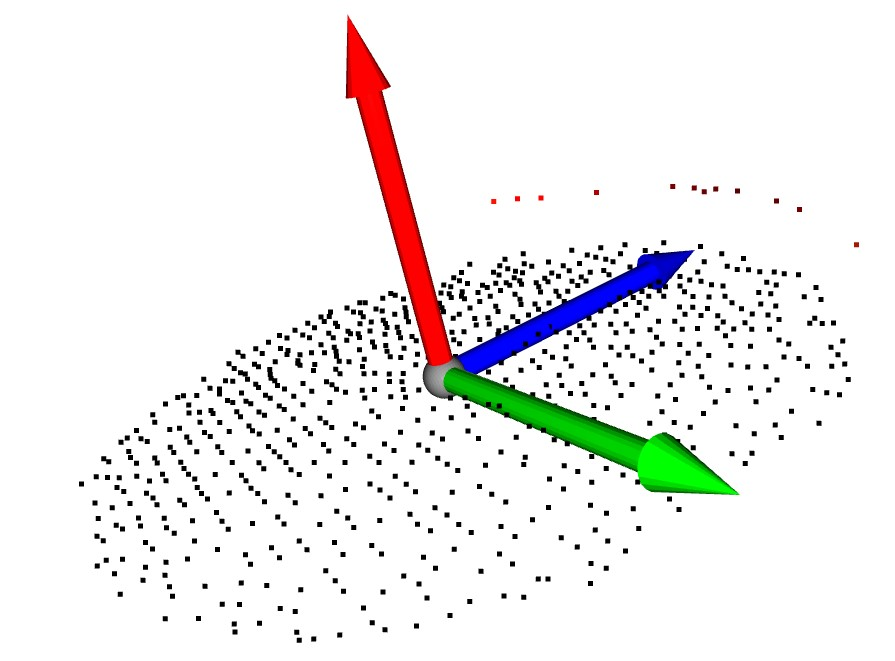
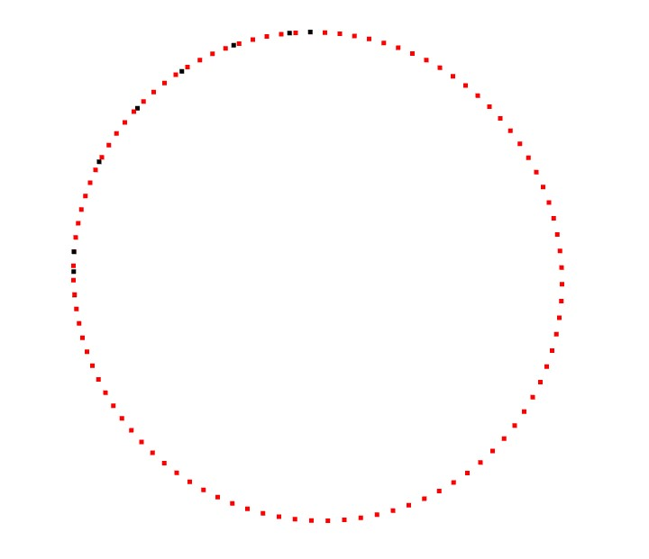

# 3D_Segmentation_and_Fit


### Introduction

该项目包括点云去噪、轮廓提取、瓶身点云切割、点云配准、基于高斯牛顿迭代法求瓶身点云尺寸、基于最小二乘法求瓶塞点云尺寸等

<p align="center"></p>

### Required environment

- Ubuntu 18.04 or above / Windows 10 or above
- PyTorch 1.10.1 or above
- CUDA 11.0 or above

### Installation


1. Install [PyTorch](https://pytorch.org/)

2. Install python packages
   ```Shell
   pip install -r requirement.txt
   ```
3. PointCloud Regisration
   ```shell script
   sudo apt install cmake libeigen3-dev libboost-all-dev
   conda create -n teaser_test python=3.6 numpy
   conda activate teaser_test
   conda install -c open3d-admin open3d=0.9.0.0
   cd TEASER && mkdir build && cd build
   cmake -DTEASERPP_PYTHON_VERSION=3.6 .. && make teaserpp_python
   cd python && pip install .
   cd ../.. && cd examples/teaser_python_ply 
   python teaser_python_ply.py
   ```
   
### Running the project
(1) 基于点云转换的瓶身点云轮廓分割算法
```Shell
cd SCAN_AerialLazer
python compute_arc.py
   ```
1、核心内容：
对原始点云数据进行离群点去噪后使用OBB函数将点云数据转换至以坐标系原点为中心，并得到其中的转换关系tf1，此时计算点云中最大的z值，以该z值为阈值去除不包含瓶底部分的点云。然后再使用OBB函数将处理后的瓶底点云转换至以坐标系原点为中心，并得到其中的转换关系tf2，此时可以将坐标系的x轴看作瓶底点云的法线。最后利用得到的转换关系tf1及tf2，将原始点云数据的瓶底部分转换至以坐标系原点为中心，并将X轴方向的单位向量（1，0，0）作为裁切平面法线，设置裁切平面的x值以调整裁切位置。

2、算法实现过程：
（1.1）原始点云与坐标轴相对关系（数据来源：SCAN）：

 <p align="center"></p>
 
（1.2）将点云数据转换至坐标系原点，得到转换关系tf1，并基于高度差对点云去噪，得到瓶底点云：

 <p align="center"></p>
 
（1.3）将瓶底点云转换至坐标系原点，得到转换关系tf2：

 <p align="center"></p>
 
（1.4）基于第二步和第三步得到的转换关系tf1和tf2，将原始点云数据进行转换，使其瓶底点云以坐标系原点为中心：

 <p align="center"></p>
 
（1.5）将X轴方向的单位向量（1，0，0）作为裁切平面的法线，设置裁切平面的x值进行瓶身圆弧切割：

 <p align="center"></p>

（1.6）高斯牛顿迭代法拟合圆弧，结果如下：

 <p align="center"></p>
 
 半径：10.8441mm（直径为21.688mm）
 真实直径：21.94mm（误差为 -0.252mm）

